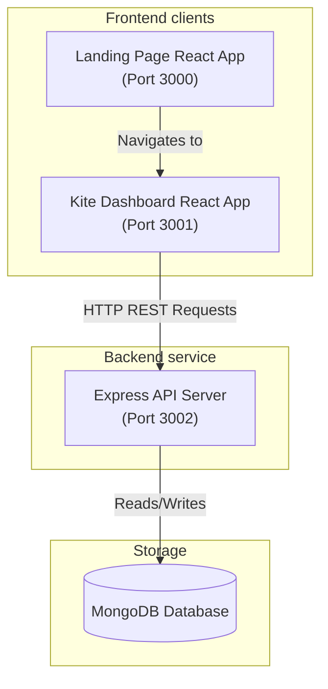

# Zerodha Clone - Full-Stack Stock Trading Platform

A full-stack clone of the Zerodha stock trading platform consisting of a consumer-facing marketing landing page, an interactive trading dashboard (resembling Kite), and an Express API connected to MongoDB.

---

## 🏗️ Architecture Overview

The system is designed with a decoupled architecture featuring three main components:

1. **Frontend Landing Page (`/frontend`)**:
   - Built with **React** and styled with **Bootstrap & Custom CSS**.
   - Serves as the user-facing marketing site showcasing products, pricing, about section, and support.

2. **Kite Dashboard (`/dashboard`)**:
   - Built with **React** and **Chart.js** (`react-chartjs-2`).
   - Leverages React Context API (`GeneralContext.js`) to manage state for buy/sell operations, active pages, and dialog visibility.
   - Includes real-time watchlist, holdings, positions, and funds tracking.

3. **Backend API (`/backend`)**:
   - Built with **Node.js** and **Express**.
   - Connected to **MongoDB** using **Mongoose**.
   - Exposes RESTful endpoints for retrieving portfolio positions, holdings, and placing new orders.

### System Architecture Diagram



---

## 🔌 API Endpoints

The backend Express application exposes the following endpoints:

| Endpoint | Method | Description | Request Body / Response |
| --- | --- | --- | --- |
| `/allHoldings` | `GET` | Retrieves all stock holdings from the database | Returns JSON list of holdings |
| `/allPositions` | `GET` | Retrieves all open positions | Returns JSON list of positions |
| `/newOrder` | `POST` | Places a new buy/sell order | Expects `{ name, qty, price, mode }`<br>Returns `"Order saved!"` |

---

## 🛠️ Installation & Setup

### Prerequisites
- **Node.js** (v16+ recommended)
- **MongoDB** (local installation or MongoDB Atlas cloud URI)

### 1. Backend Setup
1. Navigate to the backend directory:
   ```bash
   cd backend
   ```
2. Install dependencies:
   ```bash
   npm install
   ```
3. Set up environment variables:
   - Create a `.env` file from `.env.example`.
   - Add your MongoDB Connection String:
     ```env
     MONGO_URL=mongodb://localhost:27017/zerodha
     PORT=3002
     ```
4. Run the backend:
   ```bash
   npm start
   ```

### 2. Frontend Landing Page Setup
1. Navigate to the frontend directory:
   ```bash
   cd ../frontend
   ```
2. Install dependencies:
   ```bash
   npm install
   ```
3. Run the development server:
   ```bash
   npm start
   ```

### 3. Kite Dashboard Setup
1. Navigate to the dashboard directory:
   ```bash
   cd ../dashboard
   ```
2. Install dependencies:
   ```bash
   npm install
   ```
3. Run the development server:
   ```bash
   npm start
   ```

---

## 📈 Features
- **Interactive Watchlist**: Real-time listing of stocks, stock percentage changes, hover action triggers, and index info.
- **Order Execution**: Direct buy/sell order window integration saving history back to the database.
- **Portfolios Visualized**: Interactive doughnut and bar charts for investment distribution.
- **Funds Panel**: Simulated margin availability and usage calculations.
